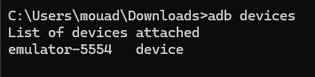
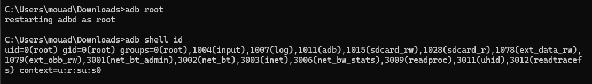
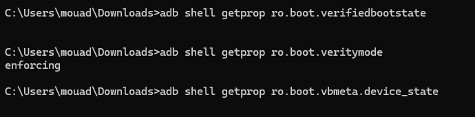
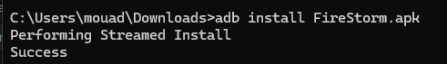
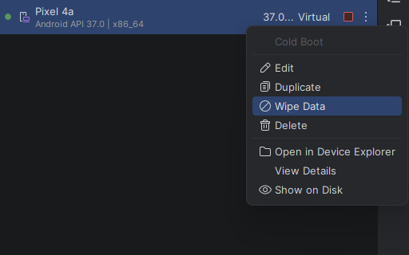

# Android Security Lab 5

## Objectif
Comprendre le rooting sur un environnement Android de laboratoire, observer son impact sur les controles d'integrite, et documenter une remise a zero propre de l'AVD.

## Fiche environnement

| Champ | Valeur |
|---|---|
| Date | 26/04/2026 |
| Auteur | CHARRAJ Mouad |
| Support | AVD Pixel 4a |
| Android | API 37 x86_64 |
| Application | FireStorm.apk |
| Version app | Non affichee dans la capture |
| Donnees | Fictives uniquement |
| Reseau | Test |
| Objectif | Comprendre rooting et impacts |

## Definition du rooting
Le rooting consiste a obtenir les privileges super-utilisateur sur Android.  
Dans ce laboratoire, l'elevation de privileges a ete activee sur l'AVD via `adb root`.  
La commande `adb shell id` retourne `uid=0(root)`, ce qui confirme l'acces root.  
Le rooting est utile en environnement de test, mais il diminue la confiance accordee a l'integrite native du systeme.

## Verified Boot / AVB

Schema simple de la chaine de confiance :

```text
ROM de demarrage
    -> Bootloader
        -> Verification de l'image de boot
            -> Verification de l'integrite systeme
                -> Demarrage Android
```

Role general :
- Verified Boot verifie que le systeme demarre dans un etat attendu.
- AVB modernise ce controle et ajoute une protection contre le rollback.

Observation sur l'AVD teste :
- `ro.boot.veritymode` retourne `enforcing`
- `ro.boot.verifiedbootstate` n'est pas renseignee par cette image AVD
- `ro.boot.vbmeta.device_state` n'est pas renseignee par cette image AVD

## Risques identifies

| Risque | Resume |
|---|---|
| Integrite non garantie | Un environnement root peut biaiser les conclusions de securite. |
| Surface d'attaque accrue | Un appareil privilegie expose davantage de points d'entree. |
| Exposition de donnees | Des donnees sensibles seraient plus faciles a extraire si elles etaient presentes. |
| Instabilite systeme | Les modifications bas niveau peuvent rendre les tests non reproductibles. |
| Melange perso/test | L'usage d'un environnement non dedie peut provoquer des fuites d'information. |
| Mauvais nettoyage | Des traces peuvent rester entre deux seances si le reset n'est pas fait. |
| Reseau non isole | Un trafic de test mal controle peut affecter d'autres systemes. |
| Tracabilite insuffisante | Sans preuves ni journal, l'audit ne peut pas etre reproduit correctement. |

## Mesures defensives

| Mesure | Resume |
|---|---|
| Reseau isole | Limiter toute communication non controlee hors du labo. |
| Donnees fictives | Eliminer le risque de fuite de donnees reelles. |
| AVD dedie | Utiliser un support reserve aux tests de securite. |
| Wipe en fin de seance | Revenir a un etat propre avant toute reutilisation. |
| Journal technique | Conserver les commandes et observations essentielles. |
| Aucun compte personnel | Eviter tout melange avec des donnees privees. |
| Controle des APK | Installer uniquement les fichiers necessaires au test. |
| Captures horodatees | Garder des preuves simples et verifiables. |

## MASVS

- `STORAGE-1` : les donnees sensibles doivent etre stockees de facon securisee et ne pas reposer uniquement sur la protection du systeme.
- `NETWORK-1` : les communications reseau doivent utiliser TLS avec une verification correcte des certificats.

## MASTG

- Verifier si des informations sensibles apparaissent en clair dans les fichiers prives de l'application.
- Analyser `adb logcat` pour detecter d'eventuelles fuites d'informations pendant l'execution.

## Scenarios realises

1. Demarrage de l'AVD et verification de la connexion ADB.
2. Elevation de privileges sur l'emulateur avec `adb root`.
3. Installation de l'application de test et ouverture de l'application.

## Preuves

### 1. Detection de l'AVD
`adb devices`



### 2. Elevation de privileges et confirmation root
`adb root` puis `adb shell id`



### 3. Verification des proprietes de boot
`adb shell getprop ro.boot.verifiedbootstate`  
`adb shell getprop ro.boot.veritymode`  
`adb shell getprop ro.boot.vbmeta.device_state`



### 4. Installation de l'application
`adb install FireStorm.apk`



### 5. Application ouverte


### 6. Preparation de la remise a zero
`Android Studio > Device Manager > Wipe Data`



## Checklist de reset

- [x] AVD de laboratoire utilise
- [x] Aucun compte personnel engage
- [x] Root active uniquement dans le cadre du test
- [x] APK de test installee
- [x] Action `Wipe Data` preparee en fin de seance
- [x] Remise a zero prevue comme etape obligatoire

## Conclusion
Le test confirme qu'un AVD peut etre place en mode root de laboratoire via `adb root`, puis verifie avec `adb shell id`.  
L'environnement reste adapte a une demonstration controlee du rooting, de Verified Boot et des bonnes pratiques de tracabilite et de nettoyage.  
Le reset de l'AVD fait partie integrante du protocole afin de conserver un environnement jetable, propre et reproductible.
